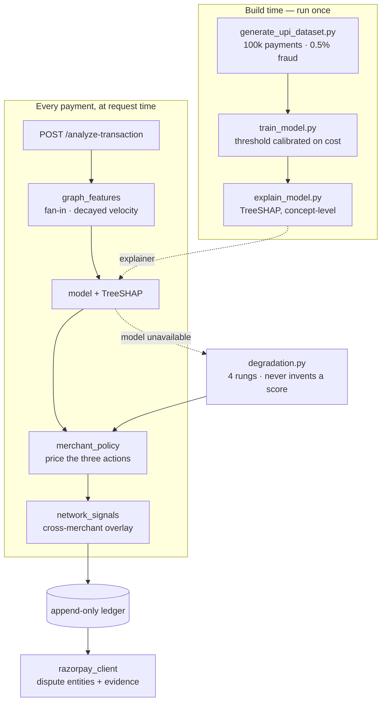

<div align="center">

# FinGuard

**Merchant-side payment risk — priced in rupees, explained, and answerable months later**

[](https://github.com/vaishnaviganesh25/chintumintu/actions/workflows/ci.yml)
[](LICENSE)
[](https://www.python.org/)
[](https://fastapi.tiangolo.com/)
[](https://react.dev/)

</div>

FinGuard stops a merchant losing money to payment fraud, and defends the disputes that
get through anyway. It is not a score in a notebook: every decision is **priced against
the merchant's own cost structure**, explained with signed contributions, written to an
append-only ledger, and replayable months later. When the model is unavailable the
engine keeps scoring — and says so, instead of inventing a number.

```bash
docker compose up --build      # dashboard :5173  ·  API docs :8080/docs
```

---

## Highlights

|  |  |
| --- | --- |
| **Detection** | PR-AUC **0.9975** on a test split grouped so no scam incident straddles the boundary |
| **What it saves** | **₹102,887** of merchant loss per 20,000 payments, against **₹242,553** for a single block/allow threshold |
| **Priced, not thresholded** | Each payment is costed as ACCEPT / CHALLENGE / HOLD and the cheapest wins — unless cross-merchant evidence escalates it, in which case the console says so. A threshold on a score is the baseline this beats, not the design |
| **Graph layer** | Fan-in and decayed collection velocity recover **60%** of the ground lost by dropping account age — PR-AUC 0.8808 → 0.9506 |
| **Honesty** | Grouping the split *cost* headline performance, and it stayed grouped. Every feature block has an ablation in the run report |
| **Resilience** | Four rungs of degradation — kill the model and it still scores, marks itself `degraded`, and never fabricates a probability |
| **Tested** | **281** Python + **74** TypeScript, including property-based tests and a packaging guard |

## How it fits together



The path that matters is the middle band. A probability is only an input: the merchant's
cost structure turns it into an action, cross-merchant reputation can escalate that
action, and the ledger records what happened so a dispute months later can be answered
with the evidence that was actually used.

## Modules

| # | Module | Script | What it produces |
| --- | --- | --- | --- |
| 1 | Synthetic data | `generate_upi_dataset.py` | `upi_synthetic_data.csv` |
| 2 | ML engine | `train_model.py` | `models/`, `reports/` |
| 3 | Explainable AI | `explain_model.py` | `reports/explanations/` |
| 4 | REST API | `main.py` | FastAPI service on `:8080` |
| 5 | Decision ledger | `audit_store.py` | `data/finguard_audit.db` |
| 6 | Chargeback responder | `chargeback_agent.py` | representment packets, LLM-drafted |
| 7 | Degradation ladder | `degradation.py` | keeps scoring when the model cannot |
| 8 | Graph layer | `graph_features.py` | fan-in, fan-out, collection velocity |
| 9 | Razorpay disputes | `razorpay_client.py` | dispute entities, optional live client |
| 10 | Network reputation | `network_signals.py` | cross-merchant evidence, as an overlay |
| — | Merchant economics | `merchant_policy.py` | the cost model every decision is priced in |
| — | Dashboard | `finguard-dashboard/` | React + Vite console on `:5173` |
| — | Serving check | `predict_example.py` | proves the saved artifacts round-trip |
| — | Claims check | `verify_claims.py` | re-derives every number below from the artifacts |

## Getting started

The one-liner above builds and runs everything. To work on it directly:

```bash
pip install -r requirements.txt

python generate_upi_dataset.py    # ~30 s
python train_model.py             # ~110 s
python explain_model.py           # ~100 s
python predict_example.py         # verifies the saved artifacts round-trip
python main.py                    # serves the API on http://localhost:8080
```

```bash
cd finguard-dashboard
npm install
npm run dev                       # console on http://localhost:5173
```

### Checks

```bash
pip install -r requirements-dev.txt
pytest                            # 281 tests
pytest -m "not slow"              # 244 of them, no model artifacts needed
ruff check .                      # lint; configured in pyproject.toml
python verify_claims.py           # every number below, re-derived from the artifacts
python -m bandit -q -r . -x ./finguard-dashboard,./tests
python -m pip_audit -r requirements.txt

cd finguard-dashboard && npm run test:run    # 74 tests
```

The generator is byte-reproducible: `python generate_upi_dataset.py` twice, under any
`PYTHONHASHSEED`, produces the same CSV. That was not true until CI caught it — the city
pool was built from a set comprehension, whose iteration order CPython randomises per
process, and the weights applied to it are positional. `sender_city` is a model feature,
so two seeded runs of a generator documented as reproducible built different datasets.
Transaction ids came from `uuid.uuid4()`, which ignores every seed in the file. Both are
fixed and guarded by tests.

`verify_claims.py` is the unusual one. Every headline figure in this file is re-derived
from `models/model_config.json` and `reports/evaluation_report.txt` and compared against
the prose; a mismatch fails CI. It exists because this README once cited a 0.9% dispute
ceiling for a card-network programme that had been retired for a year, quoted three
different test counts on one screen, and reported model metrics from two feature sets
ago. None of that was dishonest and all of it was wrong, which is the failure mode
documentation actually has.

[`AGENTS.md`](AGENTS.md) is the short structural tour, for agents and for anyone who
wants the map before the essay. [`SECURITY.md`](SECURITY.md) covers what is scanned,
what is deliberately suppressed and why, and — more usefully — the threat model this
project does *not* cover.

> [!WARNING]
> **The dependency bounds in `requirements.txt` are load-bearing.** SHAP needs numba,
> numba caps numpy below 2.5, and pandas 3.x with numpy 2.4 **segfaults** on ordinary
> `.loc` indexing — a hard process crash rather than an exception. pandas 2.3 + numpy 2.4
> is the coherent combination. Do not raise those upper bounds without rerunning all
> three modules end to end.

<details>
<summary><b>Contents</b> — the rest of this file is the engineering record</summary>

- [Module 1 — Synthetic UPI Transaction Dataset](#module-1--synthetic-upi-transaction-dataset)
- [Module 2 — Predictive ML Engine](#module-2--predictive-ml-engine)
- [Module 3 — Explainable AI](#module-3--explainable-ai)
- [Module 4 — REST API](#module-4--rest-api)
- [Module 5 — Decision ledger](#module-5--decision-ledger)
- [What the group-aware split cost](#what-the-group-aware-split-cost)
- [Merchant economics — what a decision actually costs](#merchant-economics--what-a-decision-actually-costs)
- [Module 6 — Chargeback evidence responder](#module-6--chargeback-evidence-responder)
- [Module 7 — The degradation ladder](#module-7--the-degradation-ladder)
- [Module 8 — The graph layer](#module-8--the-graph-layer)
- [Module 9 — Razorpay-shaped disputes](#module-9--razorpay-shaped-disputes)
- [Module 10 — Cross-merchant reputation, and what Vulcan changed here](#module-10--cross-merchant-reputation-and-what-vulcan-changed-here)
- [The console](#the-console)
- [Containers and CI](#containers-and-ci)
- [Dashboard — React frontend](#dashboard--react-frontend)
- [Tests](#tests)

</details>

---

## Module 1 — Synthetic UPI Transaction Dataset

A seeded generator that produces 100,000 realistic Indian UPI transactions with 0.5%
fraud, injected as three scam patterns actually seen in the Indian payments ecosystem.

Real UPI data is confidential, so this stands in as a faithful substitute for
model development, threshold tuning, and SHAP explainability work.

### Setup

```bash
python generate_upi_dataset.py
```

Runtime is roughly 30 seconds and the output is `upi_synthetic_data.csv` (~13 MB).
`SEED = 42` makes every run byte-identical; change it for a fresh sample.

### Schema

| Column | Type | Description |
| --- | --- | --- |
| `transaction_id` | str | Unique UUID4. |
| `timestamp` | datetime | Rows are sorted ascending, so the file can be replayed as a stream. |
| `sender_vpa` | str | Payer handle: `firstname.lastname@okicici` or `9876543210@ybl`. |
| `receiver_vpa` | str | Payee handle: QR terminals (`q53337100@icici`), businesses (`raju.kirana@okbizaxis`), billers, or peers. |
| `sender_city` | str | Home city of the payer, constant per sender (Faker `en_IN`, weighted towards metros). |
| `amount` | float | INR. |
| `receiver_vpa_age_days` | int | Age of the payee VPA **at transaction time**, 0–1000. Derived from a per-VPA creation date, so a VPA correctly ages across the window. |
| `time_since_last_txn_sec` | int | Seconds since that sender's previous transaction; `-1` for their first row in the dataset. |
| `is_fraud` | int | Target: 0 legitimate, 1 fraud. |
| `fraud_pattern` | str | Which scam produced the row (`none` for legitimate). |

> **Drop `fraud_pattern` before training.** It is a label-derived column, kept only
> so you can score recall per scam type and check what the explainer attributes to each.

### Legitimate behaviour (99,500 rows)

- **70% micro-payments, ₹10–₹500** — chai, autos, kirana stores; clustered on round
  values (₹10/₹20/₹50/₹100/₹200) the way real UPI spending is.
- **30% higher value, ₹1,000–₹15,000** — rent, utilities, EMIs, dining.
- **Hour-of-day intensity curve** peaking 09:00–21:00 and nearly flat 01:00–04:00,
  which is what gives the odd-hour fraud signature its contrast (~1.1% of legitimate
  traffic falls in the 01:00–04:00 window).
- Senders and receivers are drawn with gamma-distributed weights, so a few accounts
  are much busier than the rest instead of everything being uniform.
- **~6% of legitimate traffic goes to newly onboarded receivers** — 1,000 VPAs created
  *during* the window (a friend who just installed the app, a vendor registering a QR
  code). Payments cluster in the first days after signup, so roughly 4,500 legitimate
  rows land on a receiver 2 days old or younger. See below for why this matters.

### Fraud signatures (500 rows, 0.5%)

| Pattern | Rows | Signature |
| --- | --- | --- |
| `rupee_1_test` | 200 (100 incidents × 2 legs) | Exactly ₹1 to "verify the account", then ₹10,000+ to the **same** receiver within 12–60 seconds. Both legs are labelled fraud. |
| `new_vpa_velocity` | 150 (30 mules × 5) | A mule VPA with `receiver_vpa_age_days = 0` collects 5 transfers of ₹15,000–₹90,000 from 3 victims inside minutes; two victims send twice ("the refund failed, send again"). |
| `odd_hour_phishing` | 150 | ₹20,000+ between 01:00 and 04:00 to a recently created VPA — credential compromise or a screen-sharing scam draining an account overnight. |

### Deliberate class overlap

The generator plants legitimate rows that *look* suspicious on a single feature, so
the labels are not separable by one threshold:

- ~290 genuine ₹1–₹5 test transfers with **no** high-value follow-up. Only the
  ₹1-then-₹10,000 *pair* is fraudulent, not the ₹1 itself.
- ~1,110 genuine payments at or above ₹15,000 (deposits, college fees, jewellery),
  overlapping the fraud amount range.
- ~2,490 legitimate payments to VPAs that are 0 days old, ~4,515 to VPAs 2 days or
  younger.
- ~235 of those new-VPA payments are also ₹15,000+ — a deposit to a landlord who just
  opened a VPA, a second-hand bike off a classifieds listing.
- ~90 legitimate bursts under 60 seconds apart.

Tune with `LEGIT_TINY_PROBE_SHARE`, `LEGIT_BIG_TICKET_SHARE`, `NEW_ADOPTER_TXN_SHARE`
and `NEW_ADOPTER_BIG_TICKET_SHARE`; set them to `0.0` for a strictly clean split.

#### Why the new-VPA overlap is sized the way it is

The first version of this generator made `receiver_vpa_age_days` a giveaway: every
fraudulent receiver was 0–20 days old and almost every legitimate one was 150+, so
"the receiver is new" was close to a complete answer. SHAP confirmed the model had
noticed, and the ablation showed how much of the headline score rested on that one
column. A model trained that way learns the artefact rather than the behaviour.

Two layers fix it. The precisions below are measured directly on the generated
dataset — `receiver_vpa_age_days` and `amount` against `is_fraud`, so they are
reproducible from the CSV without training anything:

| Rule a lazy model might learn | Precision on this data |
| --- | --- |
| receiver ≤ 20 days old | 7.1% |
| receiver ≤ 2 days old | 6.3% |
| receiver ≤ 20 days old **and** amount ≥ ₹15,000 | 62.4% |

The first layer is volume — enough ordinary micro-payment traffic to new accounts
that age alone is a hint, not a verdict. The second is the big-ticket tail, without
which closing the age gap merely moves the shortcut to "new receiver *and* large
amount". What still separates the classes is shape rather than any single value: a
burst of transfers to one fresh account, a ₹1 probe followed by a large leg seconds
later, ₹20,000 moving at 3 AM.

Every run prints a validation report covering row counts, the fraud rate, per-pattern
integrity checks, these overlap counts, and the precision table above.

### Notes and limitations

- Amounts are capped at ₹99,999 for fraud and ₹200,000 for legitimate big-ticket
  payments, in line with UPI per-transaction limits.
- Because fraud is injected by construction, a model trained here learns *these three*
  patterns. Treat strong metrics as a check that the pipeline and explanations work,
  not as evidence of real-world detection performance.
- Fraud is spread uniformly across the 30 days; there is no campaign burstiness,
  device/IP context, or transaction-declined history yet — natural next extensions.

---

## Module 2 — Predictive ML Engine

`train_model.py` engineers features, trains and compares XGBoost against Random
Forest, calibrates a decision threshold, and serialises the winner for real-time
scoring. Everything it prints is also written to `reports/evaluation_report.txt`.

### Pipeline

1. **Feature engineering** — 33 features from 6 raw columns: temporal
   (`hour_of_day`, `day_of_week`, `is_night_txn`, cyclical hour encoding), amount
   (raw, log, micro-payment and round-number flags), receiver reputation (VPA age,
   new/recent flags), velocity (`time_since_last_txn_sec`, `is_rapid_txn`,
   `is_first_txn`), VPA structure (bank handle, mobile-number VPA, merchant-like
   pattern, suspicious keywords, digit ratio), and backward-looking lags
   (`prev_amount`, `same_receiver_as_prev`) that let the model see the ₹1-test *pair*.
2. **Preprocessing** — a `ColumnTransformer` with median imputation plus
   `RobustScaler` for numerics (UPI amounts are heavy-tailed; `StandardScaler` would
   let a few ₹2 lakh transfers squash the entire ₹10–500 cluster), passthrough for
   binaries, and `OneHotEncoder(min_frequency=50)` for handles and cities.
3. **Models** — XGBoost with `scale_pos_weight ≈ 199` and `aucpr` early stopping;
   Random Forest with `class_weight='balanced_subsample'`.
4. **Selection** — 5-fold cross-validated PR-AUC. A single split holds only ~80–100
   positives, where both models score a saturated 1.0000 and the comparison is a
   coin flip; cross-validation pools ~400 positives and separates them cleanly.
5. **Threshold calibration** — on out-of-fold probabilities, never the test set.
6. **Artifacts** — `models/` and `reports/`.

### Splits

Stratified **64 / 16 / 20** train / validation / test. The validation slice does the
two jobs that must never touch the test set: XGBoost early stopping and threshold
calibration. Calibrating a threshold on the rows you then report it on is the most
common way fraud projects overstate their precision.

### Results

Random Forest wins on cross-validated PR-AUC and is the shipped model.

| Model | PR-AUC (CV) | PR-AUC (test) | ROC-AUC (test) | F1 (test) |
| --- | --- | --- | --- | --- |
| **Random Forest** | **0.9976 ± 0.0013** | **0.9975** | 1.0000 | 0.9189 |
| XGBoost | 0.9961 ± 0.0040 | 0.9952 | 1.0000 | 0.9140 |

The gap between them is 0.0015, well inside XGBoost's own fold spread — so this is a
preference, not a verdict. Random Forest ships because its folds are tighter, not
because it is meaningfully better.

At the shipped cost-calibrated threshold of **0.1234**, the held-out set gives
**precision 0.7463, recall 1.0000**: every one of the 100 frauds caught, for 34 false
alarms across 19,900 legitimate payments. The report prints the default-threshold
confusion matrix beside it, and notes plainly that on this split 0.50 scores higher on
F1 — the calibrated point is chosen on expected rupees, not on F1, and it is the point
that lets nothing through.

Recall by scam signature, at that threshold:

| Signature | Caught | Recall | Value at risk |
| --- | --- | --- | --- |
| `new_vpa_velocity` | 30 / 30 | 100% | ₹1,744,701 |
| `odd_hour_phishing` | 30 / 30 | 100% | ₹1,203,678 |
| `rupee_1_test` — the ₹1 probe | 20 / 20 | 100% | ₹20 |
| `rupee_1_test` — the drain behind it | 20 / 20 | 100% | ₹1,369,795 |

### Three findings worth reading before trusting those numbers

**Account age is a strong feature, but no longer a shortcut.** `receiver_vpa_age_days`
and its derivatives are still the largest single block of importance, and they should
be — every fraudulent receiver in this data really is 0–20 days old. What changed is
that Module 1 routes a slice of legitimate traffic to brand-new VPAs, so the rule
"receiver is new" is only ~7% precise on its own, and even amount-plus-age tops out at
62%. The built-in ablation retrains without the age block: PR-AUC falls **0.9975 →
0.9506**.

Read PR-AUC there, not recall. Each ablation row re-calibrates its threshold on its own
out-of-fold probabilities, so the rows sit at different operating points and the recall
column is not comparable between them — it moves while precision moves the other way,
which is the threshold shifting rather than the model getting worse. PR-AUC is
threshold-free, which is exactly why it is the column to compare. **The age-ablated row
is the one to plan against**, because real account age is noisy and often missing.

**Scam incidents used to straddle the train/test boundary — the split now groups on
them.** A stratified random split cuts through an incident: the ₹1 probe lands in train
while its drain lands in test, and one mule VPA is scattered across both. Under that
split 59 of 100 test frauds shared a receiver with training fraud, so the model was
partly being asked to recognise a receiver it had already been taught. Module 1 emits a
`ring_id` on every fraud row and the split groups on it, which takes that to 0 of 100.
What it cost is measured in [What the group-aware split cost](#what-the-group-aware-split-cost).

**The obvious threshold policy is not the profitable one here.** "Maximise precision
subject to recall ≥ 90%" is the natural reading of the requirement, but the 90% floor
sits below what this model achieves, so the rule is free to climb the threshold and
trade fraud for precision. Out-of-fold it buys **+27.3 points of precision and 151 fewer
alarms** by letting **23 of 400 fraud rows through**. Charging each missed fraud its
actual amount and each false alarm a ₹150 review, that is **₹1,033,238** of expected loss
against **₹22,800** at the cost-minimising point — a 45× difference.

`train_model.py` therefore implements both rules and ships the cost-minimising one
(`THRESHOLD_POLICY = "cost"`). Set it to `"precision_at_recall"` for the literal policy;
the report prints both either way, so the trade-off is always visible. Raising
`TARGET_RECALL` closer to what the model can actually deliver has much the same effect
as switching policy.

### Artifacts

| File | Contents |
| --- | --- |
| `models/finguard_xgboost.joblib` | XGBoost pipeline (preprocessor + classifier) |
| `models/finguard_random_forest.joblib` | Random Forest pipeline |
| `models/finguard_best_model.joblib` | The selected winner — load this one |
| `models/preprocessor.joblib` | Fitted `ColumnTransformer` on its own |
| `models/model_config.json` | Threshold, feature names, all metrics, environment versions, timestamp |
| `reports/evaluation_report.txt` | The full printed report |
| `reports/pr_roc_curves.png` | PR and ROC curves, both models |
| `reports/threshold_calibration.png` | Precision/recall/F1 against threshold |
| `reports/confusion_matrices.png` | Default versus calibrated |
| `reports/feature_importance.png` | Top 20 features |

### Scoring a transaction (Module 3)

`engineer_features` is a pure, label-free function and everything else sits behind a
`__main__` guard, so importing the module does not retrain anything.

```python
import json, joblib, pandas as pd
from train_model import engineer_features

pipeline = joblib.load("models/finguard_best_model.joblib")
config = json.load(open("models/model_config.json"))

probability = pipeline.predict_proba(engineer_features(txn_df))[:, 1]
blocked = probability >= config["optimal_threshold"]
```

`predict_example.py` runs exactly this path and checks the reloaded artifact
reproduces training-time behaviour.

Two of the features (`time_since_last_txn_sec`, `prev_amount`) need the sender's
previous transaction, so a live deployment needs a sender-history lookup — a feature
store or a keyed cache. They are strictly backward-looking, so they are valid in a
streaming context; they are not free.

---

## Module 3 — Explainable AI

`explain_model.py` turns the classifier from a score into a defensible decision, at
three levels of audience.

**Concept aggregation.** The feature matrix contains `amount` and `log_amount`, and
four separate encodings of receiver VPA age. Raw SHAP splits credit between
correlated columns, which understates the true importance of the underlying fact and
produces output like *"flagged because of the amount, and the amount"*. This module
sums contributions within a concept first — valid precisely because SHAP is additive
— so each real-world fact speaks exactly once.

**1. Global.** Which concepts drive the model, and in which direction:

| Concept | Mean abs SHAP | Direction |
| --- | --- | --- |
| age of the receiving UPI ID | 0.180 | higher → safer |
| transaction amount | 0.178 | higher → riskier |
| gap since the sender's previous payment | 0.028 | higher → safer |
| jump in size versus the previous payment | 0.025 | higher → riskier |
| time of day | 0.025 | higher → safer |
| receiver looks like a registered merchant | 0.025 | higher → safer |

**2. Per scam signature.** The check that matters most for this project — is each
Indian scam caught *for the reason it is supposed to be*? Average contributions say
yes, and each pattern has a distinct fingerprint:

- **new-VPA velocity** → receiver age (+0.26), amount (+0.17), repeat receiver (+0.03)
- **odd-hour phishing** → amount (+0.19), time of day (+0.11), 1–4 AM flag (+0.09)
- **₹1-test large leg** → receiver age (+0.15), gap since previous payment (+0.13),
  repeat receiver (+0.08), amount (+0.07)
- **₹1-test probe leg** → receiver age (+0.25), amount (+0.12), non-merchant receiver (+0.04)

The large leg is the interesting one: gap-since-previous-payment and repeat-receiver
together now outweigh both age and amount, meaning the model reconstructs the *pair* —
₹13,500 landing 43 seconds after a ₹1 payment to the same receiver — rather than
reacting to the size of the transfer. That is the scam's actual definition, learned
rather than hard-coded, and it is the behaviour that survived hardening Module 1.

**3. Local, with plain-English reason codes.** Every flagged transaction gets a
waterfall chart for the audit trail and a text explanation for humans, both generated
from one explanation so they cannot drift apart:

```
odd_hour_phishing   8266605706@ibl -> girindra.bhat@ybl
Rs.25,393.08 at 25 Jul 2026, 03:45 | receiver VPA 9 days old
Fraud probability 0.9922 -> BLOCK
Flagged because:
  + transaction amount (Rs.25,393)
  + time of day (03:45)
  + sent between 1 AM and 4 AM (03:45)
Argued against by:
  - size of the sender's previous payment (Rs.87)
  - repeat payment to the same receiver (no)
```

Only risk-*increasing* factors are narrated — a customer told their payment was held
"because the amount was small" would rightly be baffled — with mitigating factors
listed separately. The same output renders a customer notification:

> We have paused a payment of Rs.25,393 from your account for your safety. It looked
> unusual because of the transaction amount (Rs.25,393) and time of day (03:45). If
> you recognise this payment, approve it in the app.

**False positives are explained too.** The report walks through a legitimate payment
the model flagged (₹35,334 to a VPA six days old, following a much smaller payment).
A wrong alert an analyst can interrogate is cleared in seconds; an unexplained score
has to be taken on faith.

### Module 3 artifacts

| File | Contents |
| --- | --- |
| `reports/explainability_report.txt` | The full printed report |
| `reports/explanations/shap_beeswarm.png` | Global distribution of contributions |
| `reports/explanations/shap_importance_bar.png` | Concept-level importance ranking |
| `reports/explanations/waterfall_*.png` | One worked case per scam signature, plus a false positive |
| `reports/explanations/global_shap_ranking.csv` | Concept ranking with directions |
| `reports/explanations/case_files.json` | Machine-readable reason codes per case |

---

## Module 4 — REST API

`main.py` serves the Module 2 classifier and the Module 3 explanation layer over HTTP
for the React dashboard.

```bash
pip install fastapi "uvicorn[standard]"
python main.py
```

The service listens on `http://localhost:8080`, with interactive docs at
[`/docs`](http://localhost:8080/docs) and a status probe at `/api/v1/health`. CORS is
open to `http://localhost:5173` and `http://127.0.0.1:5173` (both spellings, because a
browser sends whichever is in the address bar and they are different origins).

### `POST /api/v1/analyze-transaction`

Only three fields are required; the rest is optional context.

```json
{
  "sender_vpa": "9876543210@ybl",
  "receiver_vpa": "quickcash.help@paytm",
  "amount": 48500.0,
  "receiver_vpa_age_days": 0,
  "timestamp": "2026-08-01T03:12:00",
  "sender_city": "Pune",
  "time_since_last_txn_sec": 45
}
```

```json
{
  "transaction_id": "tx-0eb747b1709c",
  "status": "BLOCKED",
  "fraud_probability": 0.9823,
  "execution_time_ms": 82,
  "xai_explanation": "We have paused a payment of Rs.62,000 from your account for your safety...",
  "shap_features": [
    { "feature": "age of the receiving UPI ID", "importance": 0.2115 },
    { "feature": "transaction amount", "importance": 0.1321 },
    { "feature": "gap since the sender's previous payment", "importance": 0.0821 }
  ]
}
```

`importance` is signed: positive pushes towards fraud, negative towards legitimate,
and the list is ordered by absolute magnitude. Values are SHAP contributions summed
within a concept, so they are additive and the top entry is always the strongest
driver whichever way it points.

`status` uses the cost-calibrated threshold from Module 2 (currently **0.1230**), not
a naive 0.5. A payment can therefore be blocked at 20% probability — deliberate, since
a missed mule transfer costs its full value and a false alarm costs one ₹150 review.

### Two things about the design worth knowing

**The API keeps a short per-sender history, and it has to.** Four features are
backward-looking: the gap since the sender's last payment, that payment's size, the
ratio between them, and whether it went to the same receiver. They exist because the
₹1-test scam is invisible in one row — it is a ₹1 probe followed within seconds by a
large transfer to the *same* receiver. Score a row in isolation and `engineer_features`
sees no predecessor, fills `prev_amount = 0` and `prev_amount_ratio = amount`, and the
model reads that as an enormous spending jump.

So the two-request demo works:

```bash
# leg 1 — the probe
curl -X POST http://localhost:8080/api/v1/analyze-transaction -H "Content-Type: application/json" \
  -d '{"sender_vpa":"victim.suresh@okhdfcbank","receiver_vpa":"verify.acct@paytm","amount":1,"receiver_vpa_age_days":0}'

# leg 2 — same receiver, seconds later
curl -X POST http://localhost:8080/api/v1/analyze-transaction -H "Content-Type: application/json" \
  -d '{"sender_vpa":"victim.suresh@okhdfcbank","receiver_vpa":"verify.acct@paytm","amount":62000,"receiver_vpa_age_days":0}'
```

Leg 2 comes back at p=0.98 citing *gap since the sender's previous payment* (+0.08) and
*repeat payment to the same receiver* (+0.07) — the sequence, not just the size. The
store is an in-memory dict with a 24-hour TTL, which is honest about being
single-process; swapping it for Redis is what a second worker would require.

**Single-row scoring runs the forest single-threaded.** Module 2 fits with
`n_jobs=-1`, correct for 400 trees over 80,000 rows and wrong for scoring one:
joblib's per-call thread pool costs more than the traversal. Measured on this model,
`predict_proba` on one row is 156 ms parallel against 24 ms serial. `main.py` sets
`n_jobs = 1` on the in-memory copy at startup, taking the endpoint from ~164 ms to
~47 ms of compute (69–113 ms over HTTP). The artifact on disk is untouched.

### Other endpoints

| Method | Path | Purpose |
| --- | --- | --- |
| `GET` | `/api/v1/health` | Model name, threshold, training timestamp, senders tracked, ledger state |
| `GET` | `/api/v1/decisions` | The alert queue — recent decisions, newest first, `?only_blocked=true` |
| `GET` | `/api/v1/decisions/{id}` | Replay one decision in full, months later |
| `POST` | `/api/v1/decisions/{id}/disposition` | Record a reviewer's conclusion |
| `GET` | `/api/v1/stats` | Volume, block rate, rupees held, precision over reviewed alerts |
| `POST` | `/api/v1/disputes` | Draft a representment packet for a disputed payment |
| `GET` | `/api/v1/disputes/{id}` | Retrieve a drafted packet |
| `GET` | `/api/v1/health/deep` | Per-dependency status and the active degradation rung |
| `GET` | `/docs` | Swagger UI |

If the `models/` artifacts are missing the service still starts, but `/health` reports
`degraded` and scoring returns **503** with instructions — better than dying at import
with a stack trace the frontend developer has to go find in a terminal.

CORS allows `localhost` and `127.0.0.1` on ports 5173–5175. The extra ports are not
padding: when 5173 is occupied Vite silently moves to 5174, and without them listed
that fallback presents as a CORS failure that looks like a broken backend.

---

## Module 5 — Decision ledger

`audit_store.py` writes every score to an append-only SQLite ledger before the
response leaves the process, together with the model version that produced it and
the full SHAP vector behind it. Without this the explainability work is a rendering
concern; with it, a decision is answerable months later.

```bash
curl -s localhost:8080/api/v1/decisions/dec-8139f9c6017841a1 | jq
```

```json
{
  "decision_id": "dec-8139f9c6017841a1",
  "scored_at": "2026-08-23T01:54:20.318Z",
  "fraud_probability": 0.8217,
  "threshold": 0.1230,
  "threshold_policy": "cost",
  "decision": "BLOCKED",
  "model_name": "RandomForest",
  "model_trained_at": "2026-08-11T12:23:10+00:00",
  "shap_concepts": { "transaction amount": 0.1462, "time of day": 0.0655, "...": "22 concepts" },
  "dispositions": [{ "outcome": "confirmed_fraud", "reviewer": "analyst-1" }]
}
```

### Three properties this file exists to guarantee

**The decision record is immutable.** `decisions` is written once and never updated.
Analyst outcomes land in a separate `dispositions` table with their own rows and
timestamps, so "what the model decided" and "what a human later concluded" stay
distinguishable — and a reviewer who changes their mind appends rather than erases.
An audit trail you can edit is not an audit trail.

**The explanation is stored whole.** The API response carries the concepts that
mattered; the ledger carries all 22 with signed values. A stored top-3 would be a
*rendering* of the explanation rather than the explanation, and could never be
re-derived into a different view.

**A ledger failure never becomes a scoring failure.** Blocking a payment is the
product; recording it is bookkeeping. If the disk is full or the file is locked, the
write is logged and dropped, `decision_id` comes back `null`, and the caller still
gets a verdict — the alternative is a fraud engine that stops detecting fraud because
a log file broke. `/api/v1/health` reports `audit_ledger: degraded` so the failure is
visible rather than silent.

### Precision after deployment

`GET /api/v1/stats` reports precision over **analyst dispositions only**. In
production there are no labels, only outcomes someone eventually confirms, so alerts
nobody has reviewed are excluded rather than assumed correct — and `unclear` is
excluded from both sides. That number will differ from the one in
`reports/evaluation_report.txt`, and it is the one that would matter in operation.

Storage is SQLite in WAL mode: one file, no daemon, concurrent readers alongside a
writer, and `sqlite3` is in the standard library. At real volume this is the piece
you would swap for Postgres plus an object store for the SHAP blobs; the interface is
five methods wide to keep that swap cheap.

---

## What the group-aware split cost

Module 1 emits a `ring_id` on every fraud row: both legs of a ₹1 test, all five
transfers into one mule. The split groups on it, so no scam incident straddles the
train/test boundary.

| | Stratified split | Grouped on incident |
| --- | --- | --- |
| Test fraud sharing a receiver with training fraud | 59 / 100 | **0 / 100** |
| Test fraud on a receiver never seen in training | 41 / 100 | **100 / 100** |
| PR-AUC (test) | 0.9994 | **0.9975** |
| Recall on those unseen receivers | 100% | **100%** |
| Cross-validated PR-AUC | 0.9975 ± 0.0029 | **0.9976 ± 0.0013** |

The headline test figure falls, but the cohort it is measured on changes more than the
figure does — and that is the part worth reading. Under a stratified split the ₹1 probe
lands in train while its drain lands in test, and one mule VPA is scattered across both,
so 59 of 100 test frauds arrive at a receiver the model has already been taught is
fraudulent. Only 41 rows are a real test of generalisation. Grouping makes all 100 real.

Recall on unseen receivers is 100% either way, which is the honest reading: on this
dataset the model does generalise to receivers it has never seen. What the stratified
split was inflating was the *margin*, not the outcome — and the cross-validated mean
does not move at all (0.9975 against 0.9976) while the spread across folds more than
halves, from ±0.0029 to ±0.0013. The leak showed up as variance between folds rather
than as a flattered mean, which is the more useful thing to know: a single CV number
would have hidden it entirely.

`GROUP_AWARE_SPLIT = False` reproduces the old behaviour if you want to see the gap
yourself. The cross-validation inside model selection and threshold calibration is
grouped too; a group-aware outer split undone by a row-shuffled CV would be theatre.

---

## Merchant economics — what a decision actually costs

`merchant_policy.py` is where the bank-side framing this project started from gets
corrected. FinGuard scores payments for a **merchant on a gateway**, and that changes
the arithmetic three ways.

**A false negative is not just the transaction amount.** Fraud that clears is clawed
back *and* costs a dispute fee — ₹1,250 on the assumptions here. On a ₹200 order that
is more than seven times the basket, which is why small-ticket fraud is
disproportionately expensive and why a policy tuned on rupee value alone under-protects
it.

**A false positive is not a flat review cost.** A bank pays an analyst a fixed sum per
alert. A merchant declining a good customer loses the contribution margin on the order
plus the cost of winning them back. A flat cost is the *wrong shape*: it spends the
same ₹150 defending a ₹40 payment and a ₹90,000 one.

**There is a third action.** A gateway can *challenge* a payment — 3-D Secure, an OTP
step-up — costing a slice of conversion instead of the whole order. A bank blocks or
allows; a two-outcome policy leaves that option on the table.

| Policy | Total cost | Per txn | Held | Challenged | Fraud through |
| --- | --- | --- | --- | --- | --- |
| block / allow at 0.1234 | ₹242,553 | ₹12.13 | 134 | — | 0 |
| **accept / step-up / hold** | **₹102,887** | **₹5.14** | 78 | 840 | 0 |

Adding the challenge action saves **₹139,666 per 20,000 payments — 58% of merchant
loss** — while cutting manual holds from 134 to 78. Both policies catch everything at
this threshold; the saving is entirely in what the intervention costs.

Run ungrouped, the same comparison reads 79% (₹383,838 against ₹80,565). The two are not
directly comparable and the larger number is not the better one: each run calibrates its
own threshold, and the ungrouped baseline landed at 0.1038 against 0.1234 here, against a
model whose leaked receivers made the single-threshold policy look far worse than it is.

### The step-up budget, and why it exists

Minimising cost row by row, a challenge is so cheap that the policy will challenge
anything carrying more than a fraction of a percent of risk. On a book with diffuse
scores that reached **94% of legitimate traffic** — arithmetically optimal, and it
would destroy conversion. Friction is a portfolio resource, not a per-row one, so it
is capped at 10% of payments and spent on the rows where a challenge saves the most.
The shipped policy spends **4.20% of payments** on challenges — a little over
four tenths of the allowance, with headroom left.

That failure was found by a test, not by inspection. `test_the_step_up_budget_is_never_exceeded`
exists because of it.

### The dispute covenant, and why it does nothing here

Card networks put merchants into a remediation programme above a **1.5% ratio** — Visa
VAMP since 1 April 2026, down from 2.2%, and Mastercard ECM at the same 1.5% once a
merchant clears 100 chargebacks in a month. That is a hard operating limit, so it is
reported — at 0.0173% the shipped policy sits far inside it.

Two caveats the single ratio cannot carry. VAMP's numerator is reported fraud *plus*
disputes over settled card-not-present volume, so a disputes-only figure sits under what
Visa actually scores; and neither programme reaches the UPI leg, where disputes run
through NPCI, while the ratio here is taken across the whole book. Both are recorded
rather than silently corrected — on this dataset the covenant is slack by two orders of
magnitude either way.

This section previously cited **VDMP at 0.9%**. Visa retired VDMP on 31 March 2025 and
folded it, with VFMP, into VAMP; the figure was right for a programme that no longer
existed.

Being straight about it: at 0.5% fraud prevalence the covenant is **slack by
construction**. Even letting every fraud through would stay under the ceiling. It
begins to bind above **18.8% prevalence** at the 92% recall the age-ablated model
achieves. It is in the report because it is the real constraint in production, not
because it is doing work on this dataset.

### Same model, different merchant

No threshold constant appears in the decision. The action boundaries fall out of the
cost curves, so the same model yields a different policy per merchant:

| Order value | 4% margin | 18% margin | 60% margin |
| --- | --- | --- | --- |
| ₹200 | 0.0010 | 0.0025 | 0.0080 |
| ₹15,000 | 0.0035 | 0.0155 | 0.0500 |
| ₹90,000 | 0.0040 | 0.0165 | 0.0530 |

*Lowest fraud probability at which accepting stops being the cheapest action.* A
4%-margin reseller should challenge a ₹50,000 order at a far lower probability than a
60%-margin software seller, because a cleared fraud costs both the same while a
declined order costs the reseller much less. `python merchant_policy.py` prints it.

---

## Module 6 — Chargeback evidence responder

Detection stops a loss before it happens. `chargeback_agent.py` handles the ones that
got through: it reconstructs the case from the decision ledger and drafts the
representment packet an acquirer submits back to the network.

```bash
curl -X POST localhost:8080/api/v1/disputes -H "Content-Type: application/json" \
  -d '{"decision_id":"dec-8139f9c6017841a1","dispute_reason":"Cardholder reports an unauthorised transaction"}'
```

This is the only place in FinGuard where a language model runs, and the boundaries
around it are the interesting part.

**The model never touches the score.** A held payment has to be reproducible and
explainable months later; a non-deterministic component in the decision path would
destroy both. The Random Forest decides, the model writes.

**The evidence is retrieved by code, not by the model.** Handing it ledger tools and
letting it decide what to look up would have been easy — and would have made the
evidence behind a submitted document non-reproducible. `build_case_file` is
deterministic; the model's job is synthesis under a schema, not discovery.

**Reason codes come from an enumerated list.** Asking a model to recall a network
reason code from memory is asking for a plausible wrong one on a document bound for an
acquirer. The JSON Schema permits seven codes and nothing else.

**It is allowed to recommend giving up.** Representing a dispute you will lose costs
the filing fee again and worsens the merchant's win rate. `accept_liability` is a
first-class outcome, and the deterministic path reaches it whenever an analyst has
already confirmed fraud.

**It degrades to a template draft.** No key, a timeout, a refusal, a response that will
not validate — each falls back to a packet built from the same evidence, flagged
`degraded: true`, with `generated_by` naming the reason. A dispute has a filing
deadline; an ops team that gets nothing because a third-party API was down has been
failed by its tooling.

### Providers

Pluggable, chosen by whichever key is present — there is no provider setting to fall
out of step with the environment:

```bash
export GEMINI_API_KEY=...        # or GOOGLE_API_KEY  -> Gemini
export ANTHROPIC_API_KEY=...     #                    -> Claude
```

With neither, everything still works and every packet comes back `degraded: true`.
The schema crosses the wire as plain JSON Schema rather than an SDK-specific object,
and the response is validated against the Pydantic model **on our side** — so a
provider whose structured-output mode is loose still cannot put a malformed packet in
front of an acquirer. The tests mock the provider boundary, so neither SDK is needed
to run them.

---

## Module 7 — The degradation ladder

A fraud engine that stops scoring is worse than one that scores badly. If the model
will not load, or SHAP throws, or the process starts before its artifacts do, the
payments keep arriving. `degradation.py` gives the engine four rungs and it is always
on exactly one:

| Rung | When | What it does |
| --- | --- | --- |
| `FULL` | normal | Random Forest + SHAP, calibrated probabilities, full explanations |
| `RULES` | model unavailable | receiver ≤ 20 days old **and** ≥ ₹15,000 → hold; no SHAP |
| `VALUE_FLOOR` | rules unavailable | hold anything above ₹25,000 |
| `FAIL_SAFE` | nothing available | hold above ₹500, accept micro-payments |

Two things make this more than a `try/except`.

**Each rung is honest about what it is.** A fallback verdict carries `degraded: true`,
names its rung, and says the model was unavailable. It never invents a probability —
a made-up score would flow into the cost model and the ledger and be read months later
as though the model had produced it, so the ledger records `-1.0` and a model name of
`fallback:RULES`. A silent fallback is worse than a loud failure: the alert rate moves
and everyone assumes the world changed.

**The last rung is not "accept everything".** Failing open on a ₹90,000 payment to a
fresh account because a joblib file is missing is a real loss. Failing *closed* on
micro-payments is also wrong — it declines someone's morning chai to protect against a
risk that is not there. So the bottom rung splits on value, the one signal available
with no model, no rules and no history.

The rule on the `RULES` rung is not invented for the occasion. It is the one Module 1
measures: **62.4% precision**, against 7.1% for account age alone. A poor detector and
a good fallback, and the report states both numbers.

### Watching it happen

```bash
FINGUARD_ENABLE_CHAOS=1 python main.py

curl -X POST "localhost:8080/api/v1/admin/chaos/model?disable=true"
# score a payment -> HOLD, rung "rule engine (model unavailable)", 3 ms, no SHAP
curl -X POST "localhost:8080/api/v1/admin/chaos/model?disable=false"
```

Disabled unless `FINGUARD_ENABLE_CHAOS` is set: an unauthenticated endpoint that
switches off fraud detection should be something you opt into. `GET
/api/v1/health/deep` reports every dependency and the rung the engine would answer on
right now — the shallow probe answers *is it up*, this one answers *what can it
currently do*.

---

## Module 8 — The graph layer

`new_vpa_velocity` is a star: three victims paying one account created that morning,
inside a few minutes. Until now the model could only see it side-on — one row at a
time, inferring the ring from account age, amount and velocity. Those are proxies for
the structure, not the structure.

`graph_features.py` computes it directly. Every feature answers a question about the
*neighbourhood* a payment sits in:

| Feature | Window | What it catches |
| --- | --- | --- |
| `receiver_fanin_10m` / `_1h` | 10 min, 1 h | How many different people have just paid this account |
| `receiver_txn_count_10m` | 10 min | How fast it is collecting |
| `receiver_amount_10m` | 10 min | How much it has collected |
| `receiver_is_hub` | 10 min | Fan-in at or above 3 — the shape the scam has |
| `sender_fanout_1h` | 1 h | The mirror pattern: a compromised account spraying money |

### What it is worth

| Feature set | PR-AUC | Recall | Precision |
| --- | --- | --- | --- |
| Everything | 0.9975 | 1.00 | 0.75 |
| Without receiver VPA age | 0.9506 | 0.85 | 0.86 |
| Without graph features | 0.9675 | 0.82 | 0.98 |
| Without either | 0.8808 | 0.91 | 0.54 |

Priced against the **age-ablated** model rather than the full one, because the full
model is close to saturated and improving it proves nothing. With account age removed,
adding fan-in and collection velocity moves PR-AUC 0.8808 → 0.9506
— recovering 60% of the ground lost by dropping account age altogether.

*Read PR-AUC, not recall.* Each row is re-calibrated on its own out-of-fold
probabilities, so the operating points are not the same point and the recall column is
not comparable across rows.

**What it buys is a different kind of evidence.** Account age is an attribute of the
receiving account, so a fraudster defeats it by ageing a mule for three weeks. Fan-in
is a property of the ring's behaviour: collecting from several victims in minutes is
the thing the scam has to do to be the scam. A ring cannot age its way out of it.

### Strictly backward-looking, and you can watch it

Every window is `[t − w, t]`, closed at the current payment. Nothing reads a row that
arrives later — which is what makes the feature computable at serving time and the
offline metric honest. Scored live through the API, three victims paying one fresh
account produce:

```
payment 1   STEP_UP   p=0.3787    how fast this account is collecting  −0.0385
payment 2   HOLD      p=0.5615    how fast this account is collecting  +0.0461
payment 3   HOLD      p=0.6241    how fast this account is collecting  +0.0633
                                  how many people have just paid it    +0.0149
```

The first payment genuinely looks ordinary, and the sign flips as the ring assembles.
The model is not being shown the future; it is watching the star form. The **Ring
graph** view in the dashboard replays exactly this, transfer by transfer.

### The check that matters: are they used only where they should be?

A feature that improves the headline by firing everywhere has not learned the scam, it
has learned a shortcut. Module 3's per-signature attribution answers this directly, and
the graph features appear for exactly one pattern:

```
new_vpa_velocity            +0.2356  age of the receiving UPI ID
                            +0.1189  transaction amount
                            +0.0480  how fast this account is collecting     <-
                            +0.0352  how much this account has just collected <-

odd_hour_phishing           +0.1556  transaction amount
                            +0.1086  time of day
                            +0.0799  age of the receiving UPI ID
                            +0.0716  sent between 1 AM and 4 AM

rupee_1_test (large leg)    +0.1595  age of the receiving UPI ID
```

The mule ring is now caught partly on ring structure. The odd-hour drain and the ₹1
test are not — because they are not rings, and a fan-in feature that fired on them
would be evidence the model had found a correlation rather than a mechanism.

Globally, collection volume ranks **third of fourteen concepts** while fan-in ranks
last: most traffic has a fan-in of one, so the flag is silent until it is not. That is
the correct shape for a signal that identifies 85 rows out of 100,000 at 42% precision
against a 0.5% base rate.

Serving this needed a second history index. `TransactionHistory` keys by payer *and*
payee — the lag features want "what did this sender do last", the graph features want
"who else has paid this receiver". Indexing one side only is not a partial answer but
a wrong one: fan-in would read 1 on every live payment while training saw the true
value, and nothing would raise.

---

## Module 9 — Razorpay-shaped disputes

The disputes used to be FinGuard's own invention. They are now Razorpay's `dispute`
entity, field for field — `id`, `payment_id`, `amount` in **paise**, `reason_code`,
`respond_by` as a Unix timestamp, `status`, `phase`, and the full thirteen-field
`evidence` sub-object.

```bash
curl -X POST localhost:8080/api/v1/disputes -H "Content-Type: application/json" \
  -d '{"decision_id":"dec-...","dispute_reason":"Cardholder did not authorise this"}'
```

The `evidence` object is the important part. The responder used to emit a free-form
list, which read well and could not be submitted — an acquirer wants `shipping_proof`,
not prose. Mapping onto the real fields is what turns the packet from a plausible
document into one that could actually be filed.

**The reason code is no longer the model's to choose.** It decides which evidence is
required, so letting a language model pick it meant letting it decide what evidence
was required — backwards, and non-reproducible. Keyword triage does it now, and the
model fills the fields the code selects.

### Do you need keys from Razorpay? No

Their Disputes API exposes fetch-all, fetch-by-id, accept and contest. There is **no
create endpoint**, because disputes originate at the issuer or the network — a merchant
never raises one against itself. Test-mode credentials would return an empty list and
demo nothing.

`razorpay_client.py` talks to the live API when `RAZORPAY_KEY_ID` and
`RAZORPAY_KEY_SECRET` are set, and serves the local ledger otherwise. The mode is
reported on `/api/v1/health/deep`, so anyone demoing can see at a glance that they are
pointed at test mode.

### Amounts are in paise, once

Razorpay counts integer subunits; the model, the cost policy and every report here
count rupees. Mixing them is a factor-of-100 error that looks entirely plausible in a
log line, so the conversion lives in two named functions with property tests around
them. `to_paise` rounds rather than truncates — `int(0.1 * 3 * 100)` is 29, and a
dispute one paisa short of the payment it contests gets rejected.

---

## Module 10 — Cross-merchant reputation, and what Vulcan changed here

Razorpay announced **Vulcan** on 18 August 2026: a domain-specific transformer for
payments, trained on ~3 trillion data points across 4 billion transactions, reading
~3,000 signals per transaction. Four capabilities — hyper-precision routing,
network-level fraud detection, RTO risk intelligence, predictive checkout
personalisation. Reported: 8× more international card fraud stopped, **5× more
fraudulent or disputed transactions identified**, 8–10% better payment success.

Two things in that announcement changed this repository.

### What it exposed: a payer nobody here could see

Vulcan's second pillar is the one no individual merchant can do for itself —
*"spots fraud visible only across merchants, flagging a stolen card the moment it's
used across unrelated sellers."*

Every other feature in FinGuard is computed from what one merchant can observe. A payer
confirmed fraudulent at a phone reseller this morning is, to an unrelated grocery
merchant this afternoon, a new customer with a clean record. Only the gateway between
them knows otherwise — and a gateway is what this project models.

`network_signals.py` reads that. It is a **runtime overlay, not a model feature**, and
the distinction is the interesting part: reputation cannot be trained on. At fit time
there are no decisions yet, so a "prior holds" column would be empty or — worse —
back-filled from the labels the model is trying to predict. So the classifier never
sees it. The model scores the payment on its merits; this layer adjusts the *action*
and states its own reason. Two components, two records, both auditable.

The demonstration is a payment the model genuinely cannot judge:

```
merchant A   STEP_UP   p=0.0225     analyst confirms fraud
merchant B   ACCEPT    p=0.0000     ← clean payer, ₹2,400, ordinary grocery order
merchant B   STEP_UP   p=0.0000     ← same payment, payer confirmed elsewhere
                                      "this payer was confirmed fraudulent at another
                                       merchant 1 time in the last 7 days"
```

The score is `0.0000` in both cases. The model is not wrong — the payment really does
look ordinary. The consortium view is the only thing that separates them.

Three restraints keep this from becoming a blacklist nobody approved:

- **Only analyst-confirmed fraud escalates.** A prior HOLD is the model's opinion, and
  letting opinions escalate each other means one borderline decision follows a customer
  across every merchant they touch, compounding at each, with no human ever agreeing.
- **One step at a time.** ACCEPT → STEP_UP → HOLD. A single signal never jumps a
  payment to the most expensive action.
- **Escalation only, never de-escalation.** A clean record is the default state of
  every new customer, so treating it as positive evidence would score first-time
  buyers as riskier than returning ones — wrong, and quietly discriminatory.

### What it exposed second: a seam in this project's own features

Razorpay disclosed that Vulcan's attention is **intra-transaction, field-to-field** — a
set transformer reading every field against every other, permutation-invariant by
construction. It does not attend over an account's payment history. Velocity therefore
arrives *precomputed*, as entity fields inside that 3,000-signal vector.

Which prompted a criticism worth taking seriously, from the public discussion around
the launch: a precomputed velocity count is not the same kind of precomputed as a
token. **A window has a boundary, and a boundary is a public seam.** Pace under the
threshold and the counter resets — and the pacing is learnable from decline responses.
The proposed falsifier was specific: *if the velocity set is already decayed rather
than windowed, the seam is closed.*

FinGuard's graph features were windowed counters. So the question was answerable
directly, and the answer was not comfortable:

| Payers arriving every | `receiver_fanin_10m` | `receiver_payers_decay_slow` |
| --- | --- | --- |
| 120 s | 6 | 5.53 |
| 300 s | 3 | 4.92 |
| **601 s** | **1** | **4.12** |
| 900 s | 1 | 3.51 |
| 1800 s | 1 | 2.41 |
| 3600 s | 1 | 1.58 |

Six victims paying one mule, spaced 601 seconds apart, left fan-in reading **1 —
forever**. The hub flag never fired. A ring that paces itself one second past ten
minutes was invisible.

The fix is the one the criticism named. Exponentially-decayed counterparts, with two
time constants, alongside the windowed features rather than replacing them: a window is
the sharper signal when the burst really is inside it, and the decay is what remains
when the burst has been deliberately stretched to sit outside. Evidence now fades
smoothly instead of falling off a cliff, so there is no interval to sit just outside
of. The attacker's lever becomes "go slower", which costs them time linearly rather
than buying invisibility at one specific gap.

It costs nothing extra to maintain — state decays multiplicatively between events and
increments on arrival, one update per transaction, the same as a counter.
`tests/test_graph_features.py` pins both halves: the window's blindness is asserted
rather than quietly fixed, so the limit is documented, and a property test checks that
*no* pacing produces a cliff in the decayed measure.

### Where this project sits relative to Vulcan

Not as a competitor — the comparison would be absurd, and claiming it would be worse.
Vulcan is a foundation model over consortium-scale data; this is one engineer's
merchant-side decision layer.

The complementary reading is the honest one. Vulcan produces a **score**. What a
merchant risk desk still needs around that score is what FinGuard is: a cost model that
turns a probability into a priced action, an append-only ledger that makes the decision
answerable months later, an explanation a human can act on, and a dispute response for
the ones that get through.

And there is one gap worth naming out loud, because the trade press named it first:
Razorpay's architecture and training data are proprietary, there is no public technical
whitepaper, and — as the coverage noted — merchants have no disclosed way to audit the
model or independently verify the reported lift. Every number in this repository is
reproducible from `python train_model.py`, every ablation is printed, and every
decision replays from the ledger with the model version that made it. That is not a
criticism of a production system with real constraints. It is the axis on which a small
project can be genuinely better than a large one.

*The intra-transaction attention detail comes from public discussion of the launch
citing a Razorpay post, not from a technical paper — it is unverified here. The
windowed-counter argument stands on its own regardless of whether Vulcan's velocity
features are windowed or decayed, because FinGuard's demonstrably were.*

---

## The console

Four views behind a persistent rail: **Simulator**, **Fraud desk**, **Ring graph**,
**Model card**.

**Both themes are designed, not inverted.** Light is the default because that is what
financial tooling overwhelmingly is. Inverting a light palette produces muddy greys and
an accent that disappears — `#2F3F9E` is a confident indigo on white and invisible on
near-black — so each theme has its own tuned values in the same hue family. Three
states: `light`, `dark`, and `system` following `prefers-color-scheme`, persisted to
`localStorage` and applied by an inline script *before first paint*, so a dark-mode
viewer never gets a white flash.

**No component names a colour.** Every surface, rule and semantic state resolves
through a token in `src/index.css`. That single rule is what stops the second theme
rotting the first time someone adds a panel — and it is enforceable: a grep for
`bg-gray-`, `text-red-` and friends across `src/` returns nothing.

**Icons are hand-built.** One `Icon.tsx`, a 24-unit grid, 1.6 stroke, round joins.
No emoji anywhere — they render differently on every platform, carry no stroke weight
to match, and cannot inherit a colour token.

The **Ring graph** view uses a radial layout rather than a force simulation. Every
incident in this data is a true star, so a solver would spend its time jittering toward
an arrangement we can compute exactly, and land somewhere slightly different each run.
What is animated is the thing that matters: transfers arrive in the order they
happened, and the hub only becomes visible on the transfer where the third distinct
victim appears.

---

## Containers and CI

```bash
docker compose up --build
```

The API image trains the model at **build** time, not first-request time — a container
whose first call takes two minutes fails its own health check and gets restarted
mid-training, forever. First build is ~4 minutes; after that the layer is cached. The
ledger lives on a named volume, because a decision record that vanishes with the
container is not an audit trail. The health check uses the deep probe, so a container
serving on the fallback rung reports unhealthy rather than merely up.

CI runs the fast suite on every push, and the full end-to-end — generate, train,
explain, `predict_example.py`, both Docker builds — on `main`.

---

## Dashboard — React frontend

`finguard-dashboard/` is a Vite + React + TypeScript app that calls the Module 4 API.

```bash
cd finguard-dashboard
npm install
npm run dev        # http://localhost:5173 (start `python main.py` first)
```

The base URL comes from `VITE_API_BASE_URL` and defaults to `http://localhost:8080`;
copy `.env.example` to `.env.local` to change it.

`src/services/fraudApi.ts` is the only place that talks to the backend. It shape-checks
every response before React sees it, and translates each failure into something
actionable — an unreachable API says so and names the command to start it, rather than
surfacing the browser's bare "Failed to fetch".

### Reading the SHAP chart

The chart is diverging, not a ranked list of percentages, because real SHAP values are
**signed**: red bars pushed the transaction towards fraud, green bars argued against.
They are additive contributions that sum to the model's output, which is what makes
them an audit trail rather than a popularity ranking. A chart on a 0–100% scale would
silently drop every mitigating factor.

Similarly, the risk gauge takes its colour from the decision, not from a fixed
percentage band. The shipped threshold is 0.1230, so a payment can be blocked at 20%
risk — a gauge that turned green below 40% would contradict the BLOCKED badge above it.

### Replaying a signature

The form posts every field the API accepts — sender, receiver, amount, receiver VPA
age, transaction time, sender city, and the gap since the sender's last payment. Two
of those are not optional in practice:

- **Receiver VPA age** is the model's strongest single feature. Left blank, the
  backend assumes an established account and almost everything comes back APPROVED.
  Set it to `0` to demo a mule.
- **Transaction time** is what makes the odd-hour signature reachable. The model reads
  hour-of-day straight off the timestamp, so without it every payment is scored at the
  server's clock and a daytime demo can never produce a 3 AM phishing case.

The preset row above the form fires the three scam signatures directly. `Rs.1 test`
runs both legs in order — the probe, then the drain 43 seconds later to the same
receiver — because the scam is a *pair* and no single submission can express it. Watch
leg 1 clear and leg 2 get held citing *gap since the sender's previous payment* and
*repeat payment to the same receiver*: the sequence, not the size.

---

## Tests

```bash
pip install -r requirements-dev.txt
pytest                     # 281 tests
pytest -m "not slow"       # 244 of them; the rest need models/ on disk
cd finguard-dashboard && npm run test:run    # 74 tests
```

| File | Covers |
| --- | --- |
| `tests/test_features.py` | Feature engineering — the train/serve skew surface |
| `tests/test_thresholds.py` | Both threshold policies, checked against hand-built score distributions |
| `tests/test_api.py` | Endpoint contracts, sequence behaviour, ledger integration |
| `tests/test_audit_store.py` | Ledger immutability, failure containment, reviewed precision |
| `tests/test_merchant_policy.py` | Cost model, the step-up budget, the dispute covenant |
| `tests/test_chargeback_agent.py` | Every way a provider can fail, and the boundaries around it |
| `tests/test_degradation.py` | All four rungs, driven directly — including the two a healthy system never reaches |
| `tests/test_graph_features.py` | Window edges, and that no window ever reads forward |
| `tests/test_razorpay_client.py` | Entity shape, paise conversion, reason triage |
| `tests/test_network_signals.py` | What the consortium layer must refuse to do |
| `tests/test_packaging.py` | Every module the image imports is a module the image copies |
| `src/utils/scenarios.test.ts` | Every demo preset still produces the signature it claims |
| `src/utils/validation.test.ts` | Client-side rules, kept in step with the API's validators |
| `src/services/fraudApi.test.ts` | Response parsing, including fields an older backend omits |
| `src/services/opsApi.test.ts` | A request the app itself cancelled is not a failure to report |
| `src/components/EvaluationPanel.test.tsx` | The verdict readout, and that the costs never contradict the action |
| `src/components/XAIPanel.test.tsx` | The cited method, and that its references do not drift |

The suite is deliberately weighted towards properties rather than examples, because
the failures that matter here are silent. `engineer_features` is called from three
places — the training run, the explainer, and the API scoring one live row — and if
those ever disagree about what a column means, nothing raises. The model simply
starts scoring production traffic against a slightly different feature space than it
was fitted on, and the only symptom is an alert-rate drift that looks like the world
changing rather than a bug.

Seven real defects were found by writing these, all now fixed:

- **`split_feature_types` misclassified an all-null column as binary.**
  `dropna().isin([0,1]).all()` returns `True` on an empty Series, so a single row
  scored for a sender with no history would route `time_since_last_txn_sec` from the
  numeric branch to `passthrough` — skipping imputation and scaling, and reaching the
  classifier as a raw `NaN`. Found by a Hypothesis case with `gap = -1`.
- **Two dispositions inside the same second ordered arbitrarily.** ISO timestamps at
  second resolution tie, so "the reviewer's latest conclusion" was whichever row the
  planner happened to return, and the stats join counted one decision twice. Ordering
  now breaks the tie on `rowid`.
- **`validateTimestamp` accepted truncated dates.** `new Date("2026-08-")` does not
  fail — it returns 1 August 2026. The validator now checks the shape before parsing
  and rejects values that roll over, such as `2026-02-31`.
- **The three-action policy challenged 94% of legitimate traffic.** Row-by-row cost
  minimisation is so cheap per challenge that it will step up almost anything carrying
  risk. Arithmetically optimal, operationally absurd. Friction is now a capped
  portfolio resource, allocated by benefit.
- **The alert queue silently emptied.** `recent_decisions` filtered on
  `decision = 'BLOCKED'`, which matched nothing the moment the API began emitting
  three actions. An empty queue reads as a quiet day, not a broken filter.
- **`prev_amount_ratio` was `amount / (0 + 1)` on a first payment** — the transaction
  amount itself, and the largest value the feature can take. A first-time payer's
  ordinary ₹35,334 transfer arrived at the model looking like a 35,334× jump in
  spending. The worked false positive in the explainability report is that row.
- **The retrained model expected merchant features the API never sent.** Caught by
  `test_api.py` as `ValueError: columns are missing` the moment the category and method
  features were added — the exact train/serve skew the suite exists for.
